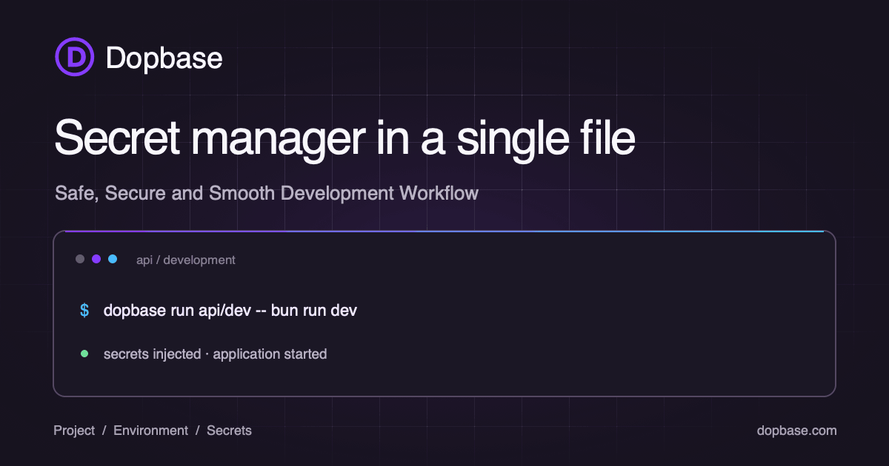
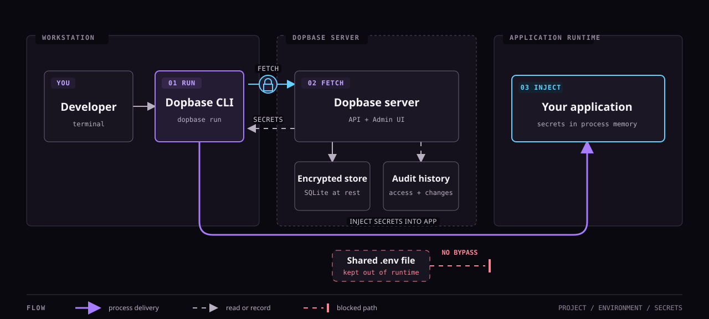

<p align="center">
  
</p>

# Dopbase

[Dopbase](https://dopbase.com) is an open-source secrets manager in a single file. One executable contains the server, Admin UI, REST API, migrations, and command-line client. It keeps application secrets organized by project and environment and runs on your own infrastructure.

The executable is a single download. Runtime data stays separate: Dopbase stores its SQLite database, configuration, and master key under `~/.dopbase` by default.

Native release archives are available for macOS and Linux on AMD64 and ARM64.

- Website: [http://dopbase.com](http://dopbase.com)
- Documentation: [http://docs.dopbase.com](http://docs.dopbase.com)

## Why Dopbase

`.env` files are convenient on one machine. They become difficult to track when a project has several developers, CI jobs, servers, and deployment environments. Dopbase is intended to add encrypted storage, individual secret records, access control, history, and audit events without requiring a large supporting infrastructure stack.

The model stays small:

```text
Project
  └── Environment
        └── Secrets
```

The server and client are built into the same `dopbase` executable:

```bash
dopbase server start
dopbase login
dopbase init payment-service development --from .env
dopbase run payment-service/development -- npm start
```

A production build embeds the Vue Admin UI in that executable. By default, its
SQLite database, lock files, configuration, and local master key live under
`~/.dopbase`; use `--data-dir` or `DOPBASE_DATA_DIR` to relocate them.

Read the [public documentation](./docs/) for the product model, CLI, self-hosting guidance, security design, and roadmap.

Dopbase 0.1.3 includes four roles, user management, read-only AI accounts, an
instance overview, and crash-safe factory reset. See [users and AI agents](./docs/ui/users.md)
and [role permissions](./docs/reference/identity.md) for how access works.
Version 0.1.0 starts with a fresh data directory; databases and backups from
earlier releases are not supported.

## How it works

One executable carries the server and the client. The client authenticates,
fetches one environment, and injects its secrets straight into your application
process no shared `.env` file in the runtime.

<p align="center">
  
</p>

See [server and client](./docs/guide/server-client.md) for the full walkthrough.

## Repository layout

| Path         | Purpose                                   | Current state                 |
| ------------ | ----------------------------------------- | ----------------------------- |
| `app/`       | Rust service and command-line application | v0.1.3 backend implementation |
| `src/`       | Vue administration interface              | Initial scaffold              |
| `docs/`      | VitePress product documentation           | Active public specification   |
| `tests/`     | Frontend tests and test setup             | Early test scaffold           |
| `app/tests/` | Rust integration tests                    | Backend and CLI test suite    |

## Development

You need **Bun** and a Rust toolchain with Rust 2024 edition support.

Install the JavaScript dependencies and start the Vue development server:

```bash
bun install
bun run dev:ui
```

Run the Rust backend without the long Cargo command:

```bash
bun run app
```

Or start the Vue Admin UI and Rust backend together:

```bash
bun run dev
```

The combined command serves the UI at `http://localhost:9000`, proxies `/api`
requests to the backend at `http://localhost:8840`, and stops both processes
when you press Ctrl-C. To serve the Admin UI and API from one executable, run
`bun run build:all` and then `./app/target/release/dopbase server start`.

Start the documentation site:

```bash
bun run docs:dev
```

The repository defines these production build commands:

```bash
bun run build
bun run build:all
bun run docs:build
```

See [CONTRIBUTING.md](./CONTRIBUTING.md) for the full setup, checks, and pull-request expectations.

### Rust test placement

Keep `app/src/` production-only. All Rust test cases belong under `app/tests/`
as integration tests. Do not add `#[cfg(test)]` modules, `#[test]`,
`#[tokio::test]`, or `*_test.rs` files anywhere under `app/src/`; add or update
the corresponding test file in `app/tests/` instead. This keeps the production
source tree clean and makes the test boundary clear for both humans and AI
contributors.

## Security

Do not report vulnerabilities in a public issue. Follow [SECURITY.md](./SECURITY.md) to use GitHub private vulnerability reporting. Never include live credentials or private service details in a report, test, log, or screenshot.

## License

Dopbase is licensed under the [Apache License 2.0](./LICENSE). Attribution information is available in [NOTICE](./NOTICE).
