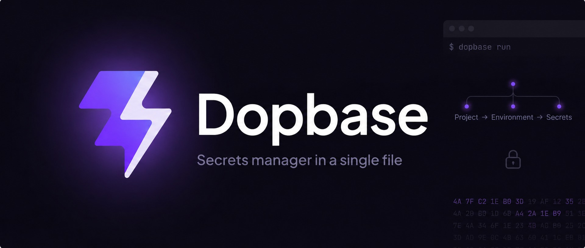

<p align="center">
  
</p>

# Dopbase

Dopbase is an open-source secrets manager designed to run as one executable. It keeps application secrets organized by project and environment, with a command-line client that can connect to either a self-hosted server or Dopbase Cloud.

> [!WARNING]
> Dopbase is pre-release software. The repository currently contains early Rust and Vue scaffolding, not a production-ready secrets manager. The public documentation describes the intended v0.1 experience and marks unfinished behavior as planned.

## Why Dopbase

`.env` files are convenient on one machine. They become difficult to track when a project has several developers, CI jobs, servers, and deployment environments. Dopbase is intended to add encrypted storage, individual secret records, access control, history, and audit events without requiring a large supporting infrastructure stack.

The planned model stays small:

```text
Project
  └── Environment
        └── Secrets
```

The server and client will ship in the same `dopbase` executable:

```bash
# Planned interface, not available yet
dopbase serve
dopbase login
dopbase init payment-service development --from .env
dopbase run payment-service/development -- npm start
```

Read the [public documentation](./docs/) for the product model, planned CLI, self-hosting guidance, security design, and roadmap.

## Repository layout

| Path     | Purpose                                   | Current state               |
| -------- | ----------------------------------------- | --------------------------- |
| `app/`   | Rust service and command-line application | Initial scaffold            |
| `src/`   | Vue administration interface              | Initial scaffold            |
| `docs/`  | VitePress product documentation           | Active public specification |
| `tests/` | Frontend tests and test setup             | Early test scaffold         |

## Development

You need [Bun](https://bun.sh/) and a Rust toolchain with Rust 2024 edition support.

Install the JavaScript dependencies and start the Vue development server:

```bash
bun install
bun run dev
```

Run the Rust scaffold:

```bash
cargo run --manifest-path app/Cargo.toml
```

Start the documentation site:

```bash
bun run docs:dev
```

The repository defines these production build commands:

```bash
bun run build
bun run docs:build
```

See [CONTRIBUTING.md](./CONTRIBUTING.md) for the full setup, checks, and pull-request expectations.

## Security

Do not report vulnerabilities in a public issue. Follow [SECURITY.md](./SECURITY.md) to use GitHub private vulnerability reporting. Never include live credentials or private service details in a report, test, log, or screenshot.

## License

Dopbase is licensed under the [Apache License 2.0](./LICENSE). Attribution information is available in [NOTICE](./NOTICE).
