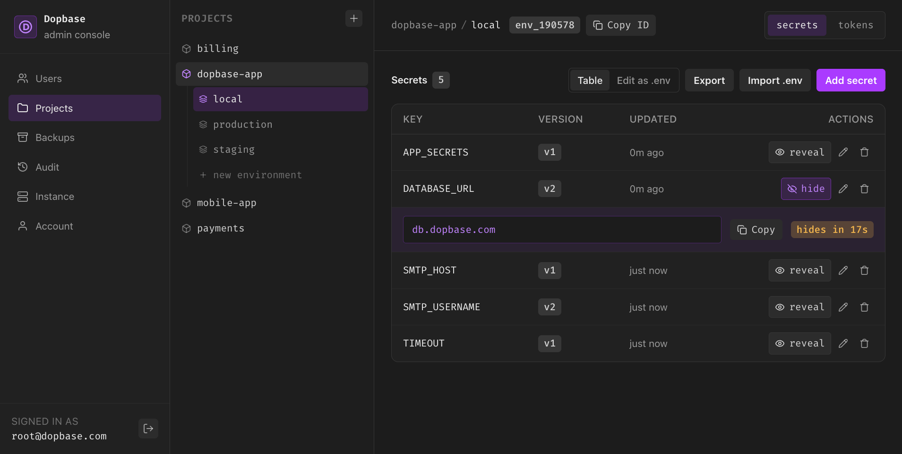
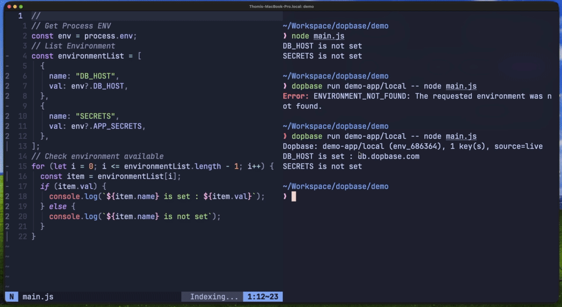

<p align="center">
  <a href="https://dopbase.com">
    
  </a>
</p>

<h1 align="center">Dopbase</h1>

<p align="center">
  Open-source, self-hosted secrets management in a single file.<br />
  One binary contains the server, Admin UI, REST API, and command-line client.
</p>

<p align="center">
  <a href="https://github.com/dopbase/dopbase/releases/latest"></a>
  <a href="https://github.com/dopbase/dopbase/releases"></a>
  <a href="https://github.com/dopbase/dopbase/actions/workflows/release.yml"></a>
  <a href="./LICENSE"></a>
  <a href="https://dopbase.com"></a>
  <a href="./docs/guide/quick-start.md"></a>
  <a href="./docs/guide/quick-start.md"></a>
</p>

<p align="center">
  <a href="#quick-start">Quick start</a> |
  <a href="#cli-reference">CLI reference</a> |
  <a href="#demo">Demo</a> |
  <a href="#why-dopbase">Why Dopbase</a> |
  <a href="https://dopbase.com/how-it-works">How it works</a> |
  <a href="https://docs.dopbase.com">Documentation</a> |
  <a href="./SECURITY.md">Security</a> |
  <a href="./CONTRIBUTING.md">Contributing</a> |
  <a href="./CODE_OF_CONDUCT.md">Code of conduct</a>
</p>

<p align="center">
  
</p>

<p align="center">
  
</p>

<p align="center">
  <sub>The Admin UI ships inside the Dopbase executable, so there is no separate frontend to deploy.</sub>
</p>

Dopbase keeps application secrets organized by project and environment on infrastructure you control. Runtime data stays separate from the executable: its SQLite database, configuration, and master key live under `~/.dopbase` by default.

## Quick start

Install the latest release on macOS or Linux, then start a local server:

```bash
curl -fsSL https://dopbase.com/install.sh | sh
dopbase server start
```

Open `http://localhost:8840` to finish setup in the Admin UI. The [quick-start guide](./docs/guide/quick-start.md) covers sign-in, importing a `.env` file, and running an application with its secrets.

Native release archives are available for macOS and Linux on AMD64 and ARM64.

## CLI reference

```text
Dopbase keeps application secrets in one binary: run a server, store secrets per project and environment, and inject them into any command with `run`.

Usage: dopbase [OPTIONS] <COMMAND>

Commands:
  server   Start, stop, inspect, and read logs from a local Dopbase server
  client   Connect the CLI to a Dopbase server (`client connect <url>`)
  login    Authenticate with the active server
  logout   Remove the saved credential for the active server
  status   Alias for `dopbase client status`
  init     Create a project, its first environment, and import secrets
  project  Manage projects (create, list, show, rename, delete)
  env      Manage environments inside a project (create, list, rename, delete)
  secret   Manage secrets in an environment (list, set, get, delete)
  import   Bulk-import secrets into an environment from a dotenv, JSON, or YAML source
  export   Export an environment's secrets as dotenv, JSON, YAML, or a Docker env file
  token    Manage CI/runner access tokens for an environment
  run      Run a command with an environment's secrets injected as env vars
  cache    Inspect and clean the encrypted runtime cache for the active server
  admin    Offline server administration
  update   Check GitHub for a newer Dopbase release (informational only)
  backup   Create an encrypted backup snapshot of the Dopbase instance
  restore  Restore the instance from an encrypted .dop backup file
  help     Print this message or the help of the given subcommand(s)

Options:
  -v, --version
          Print the installed Dopbase version

          [alias: -V]

      --server <URL>
          Client endpoint for this invocation, overriding the saved server and DOPBASE_URL. This does not apply to local server commands

      --data-dir <DIR>
          Directory for Dopbase state and configuration

      --json
          Print machine-readable JSON instead of human-readable output, where supported

  -h, --help
          Print help (see a summary with '-h')

Environment variables:
  DOPBASE_TOKEN                   Bearer token for a machine runner or AI agent. Overrides the saved login
  DOPBASE_URL                     Server URL for client commands when --server is not set
  DOPBASE_ENV                     Environment for dopbase run when its argument is omitted
  DOPBASE_DATA_DIR                State and configuration directory (default: ~/.dopbase)
  DOPBASE_HOST                    Server bind host
  DOPBASE_PORT                    Server port (default: 8840)
  DOPBASE_PUBLIC_URL              Public URL
  DOPBASE_DOCS                    Enable or disable Swagger UI (true or false)
  DOPBASE_MASTER_KEY_PATH         Path to the server master key file `./path/to/your.key`
  DOPBASE_SHUTDOWN_GRACE_SECONDS  Seconds allowed for graceful shutdown

Quickstart:
  dopbase server start                     # run a server on http://localhost:8840
  dopbase server up                        # run the server in the background
  dopbase login                            # authenticate with the active server
  dopbase init                             # create a project + environment from ./.env
  dopbase init myapp/dev --from .env       # create a project + environment from a secrets file
  dopbase secret set myapp/dev API_KEY --stdin
  dopbase run myapp/dev -- node server.js  # run with secrets injected as env vars

Common server options:
  --host <HOST>    Bind host (default: 127.0.0.1)
  --port <PORT>    Listen port (default: 8840)

Run 'dopbase help <command>' for details on any command.
```

## Why Dopbase

`.env` files are convenient on one machine. They become difficult to track when a project has several developers, CI jobs, servers, and deployment environments. Dopbase is intended to add encrypted storage, individual secret records, access control, history, and audit events without requiring a large supporting infrastructure stack.

The model stays small:

```text
Project
  └── Environment
        └── Secrets
```

The server and client are built into the same `dopbase` executable:

```bash
dopbase server start
dopbase login
dopbase init
dopbase run payment-service/development -- npm start
```

A production build embeds the Vue Admin UI in that executable. By default, its
SQLite database, lock files, configuration, and local master key live under
`~/.dopbase`. Use `--data-dir` or `DOPBASE_DATA_DIR` to relocate them.

Read the [public documentation](./docs/) for the product model, CLI, self-hosting guidance, security design, and roadmap.

Dopbase 0.1.6 includes four roles, user management, read-only AI accounts, an
instance overview, and crash-safe factory reset.

See [users and AI agents](./docs/ui/users.md) and [role permissions](./docs/reference/identity.md) for how access works.
Version 0.1.0 starts with a fresh data directory. Databases and backups from
earlier releases are not supported.

## How it works

One executable carries the server and the client. The client authenticates,
fetches one environment, and injects its secrets straight into your application
process without writing a shared `.env` file to the runtime.

<p align="center">
  
</p>

See [server and client](./docs/guide/server-client.md) for the full walkthrough.

## Demo

<p align="center">
  
</p>

<p align="center">
  <a href="https://github.com/dopbase/dopbase/raw/refs/heads/main/assets/demo-dopbase-1912.mp4">See full demo (MP4 download)</a>
</p>

## Repository layout

| Path         | Purpose                                         | Current state                 |
| ------------ | ----------------------------------------------- | ----------------------------- |
| `app/`       | Rust service and command-line application       | v0.1.6 backend implementation |
| `app/tests/` | Rust integration tests                          | Backend and CLI test suite    |
| `src/`       | Vue administration interface and frontend tests | Embedded Admin UI             |
| `docs/`      | VitePress product documentation                 | Active public specification   |

## Development

You need **Bun** and a Rust toolchain with Rust 2024 edition support.

Install the JavaScript dependencies:

```bash
bun install
```

Scripts use the `action:target` pattern. The targets are `ui`, `app`, and
`docs`. Run an action without a target for the usual combined workflow.

| Command              | Purpose                                     |
| -------------------- | ------------------------------------------- |
| `bun run dev`        | Start the Admin UI and Rust app together    |
| `bun run dev:ui`     | Start only the Admin UI development server  |
| `bun run dev:app`    | Start only the Rust API and CLI application |
| `bun run dev:docs`   | Start the documentation site                |
| `bun run build`      | Build the application and documentation     |
| `bun run build:ui`   | Build only the Admin UI                     |
| `bun run build:app`  | Build the release executable with its UI    |
| `bun run build:docs` | Build only the documentation site           |
| `bun run test`       | Run the Admin UI and Rust application tests |
| `bun run test:ui`    | Run only the Admin UI tests                 |
| `bun run test:app`   | Run only the Rust application and CLI tests |

The combined command serves the UI at `http://localhost:9000`, proxies `/api`
requests to the backend at `http://localhost:8840`, and stops both processes
when you press Ctrl-C. To serve the Admin UI and API from one executable, run
`bun run build:app` and then
`./app/target/release/dopbase server start`. App commands build the Admin UI
when the embedded assets are missing from a clean checkout.

See [CONTRIBUTING.md](./CONTRIBUTING.md) for the full setup, checks, and pull-request expectations.

### Rust test placement

Keep `app/src/` production-only. All Rust test cases belong under `app/tests/`
as integration tests. Do not add `#[cfg(test)]` modules, `#[test]`,
`#[tokio::test]`, or `*_test.rs` files anywhere under `app/src/`. Add or update
the corresponding test file in `app/tests/` instead. This keeps the production
source tree clean and makes the test boundary clear for both humans and AI
contributors.

## Security

Do not report vulnerabilities in a public issue. Follow [SECURITY.md](./SECURITY.md) to use GitHub private vulnerability reporting. Never include live credentials or private service details in a report, test, log, or screenshot.

## License

Dopbase is licensed under the [Apache License 2.0](./LICENSE). Attribution information is available in [NOTICE](./NOTICE).
