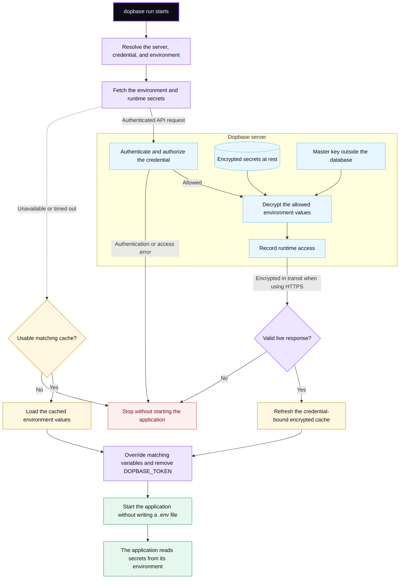

# Run an application

`dopbase run` starts a child process with secrets from one explicit environment.

Use `--` to separate Dopbase arguments from the application command:

```bash
dopbase run payment-service/development -- npm run dev
```

The same pattern works with other commands:

```bash
dopbase run payment-service/development -- cargo run
dopbase run env_482731 -- python app.py
```

The environment may be an immutable `env_...` ID or a readable
`project/environment` reference. An environment already belongs to one project,
so no active project selection is needed.

## Deployment configuration

Application servers should use an immutable environment ID and a runner token
scoped to that environment:

```bash
export DOPBASE_URL=https://dopbase.example.com
export DOPBASE_TOKEN=<environment-runner-token>
dopbase run env_482731 -- ./payment-service
```

The environment can instead come from deployment-time configuration:

```bash
export DOPBASE_ENV=env_482731
dopbase run -- ./payment-service
```

An explicit positional environment takes precedence over `DOPBASE_ENV`. If
neither is present, Dopbase uses the server-scoped default saved by:

```bash
dopbase env default payment-service/development
dopbase run -- ./payment-service
```

If no matching default exists, Dopbase stops with instructions for setting
one. Use `dopbase env default --clear` to remove it. An empty `DOPBASE_ENV` is
treated as a configuration error rather than falling back.

Use different environment IDs and runner tokens for production and staging.
See [target projects and environments](/cli/environment-targeting) for a full
two-server example.

## Data flow

Select the diagram to open the viewer. You can zoom, drag the diagram in any
direction, or use the keyboard controls.



The client retrieves the allowed values and injects them into the child process.
It does not create a `.env` file.

Each successful runtime fetch refreshes the latest encrypted cache entry for
that environment. If the server cannot be reached, times out, or returns a 5xx
response, `run` uses the matching cache after waiting up to five seconds for the
complete live fetch. Authentication, authorization, not-found, and invalid
response errors never fall back to cache.

The cache is bound to the normalized server URL and exact session or runner
token that populated it. A logout or token rotation therefore makes the old
cache unavailable. Cache entries do not expire automatically; an offline run
prints the original fetch time and age so operators can judge staleness.

Managed values override same-named variables inherited from the parent process.
Dopbase removes its own authentication variables before starting the child so
the application does not receive the credential used to retrieve its secrets.

## Runtime behavior

Before starting the application, Dopbase writes the resolved project,
environment, immutable ID, loaded key count, and `live` or `cache` source to
standard error. Cached runs also print the fetch timestamp and age. Values are
never printed.

Dopbase then:

- Stops before launch if live retrieval fails and no usable matching cache is
  available, or when authentication, authorization, environment resolution,
  response validation, or cache authentication fails.
- Forwards operating-system signals to the child process.
- Returns the child's exit status to the calling shell.
- Avoids retaining plaintext values after the child starts where practical.

Applications still need to avoid printing their own environment variables.
Dopbase cannot prevent a child process from logging a value after receiving it.
