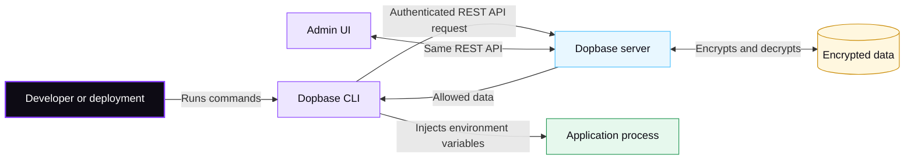

# Server and client

Dopbase uses one executable in two roles. The server protects and serves data. The client tells a server what you want to do.



## The server

`dopbase server start` runs a self-hosted Dopbase instance. The server owns:

- Encrypted secret records and their metadata
- Projects and environments
- Human users, machine identities, and service tokens
- Authentication and authorization
- Audit records
- Database migrations
- The REST API and admin interface

The admin interface is the browser UI served from the same address as the API.
It works on the same data through the same REST API, so what it changes is
immediately visible to every client. The [Admin UI guide](/ui/) documents its
screens.

Self-hosted storage uses SQLite by default. The master encryption key remains outside that database.

## The client

The client is every command that talks to a server, including `login`, project,
environment, and secret commands, `import`, `export`, and `run`.

With no machine-global configuration, the client uses the default local
endpoint:

```text
http://localhost:8840
```

Authenticate directly when using that default:

```bash
dopbase login
```

For another endpoint, `dopbase client connect` validates and saves the server in
`~/.dopbase/config.toml`, then `login` stores its token in the encrypted local
session file. Client state does not become a second source of truth for
project secrets.

The saved client state contains no active project or environment. Commands
target an environment explicitly with an immutable ID or a readable
`project/environment` reference:

```bash
dopbase run payment-service/development -- npm start
```

Application servers can avoid saved client state by providing `DOPBASE_URL`, an
environment-scoped `DOPBASE_TOKEN`, and the immutable environment ID in their
deployment configuration.

## Self-hosted and Cloud

The same client and API model apply to both deployment types:

```bash
# Another self-hosted instance
dopbase client connect https://dopbase.internal.example

# Dopbase Cloud
dopbase client connect <dopbase-cloud-url>
```

Dopbase Cloud is planned as a managed server endpoint. It will not control or
depend on an independent self-hosted installation.

## Connection failures

If the active endpoint is unavailable, client operations stop with a clear
connection error. The client does not silently switch servers, use stale secret
values, or fall back to localhost or Cloud. Localhost is used automatically
only when no endpoint is configured or overridden.

Read [client configuration](/cli/configuration) for configuration paths,
credential storage, resolution order, and multiple local instances.
