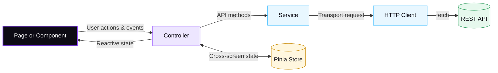

# Frontend architecture

The Admin UI follows a layered design:



Pages render values and events returned by their controller. A page does not
import an API module or a Pinia store directly. A controller owns screen state,
validation, navigation, and feedback messages. A service contains endpoint paths,
request and response types, and transport mapping. The HTTP client is the only
place that calls `fetch`.

## State and logic boundaries

- **Stores**: Use a store only when state is shared across multiple screens.
- **Utilities**: Keep pure parsing, formatting, and validation in `src/utils`.
- **Composables**: Put reactive behavior shared by multiple controllers in `src/composable`.

## Action tracing and errors

When tracing an action, start at the template event, find the controller method
returned to that template, then follow its service call.

Error codes come from `ApiError`; controllers map stable error codes to field or
operation messages. Never branch on English server messages.

## Asynchronous requests

Read requests should accept an `AbortSignal` when the screen can change while
they are in flight. The owner cancels an older request before starting a newer
one and ignores completions from a different target.

Mutations snapshot their target before awaiting and refresh state only after the
mutation succeeds.

## Verification

Run these checks before submitting frontend changes:

```bash
bun run typecheck
bunx eslint src tests
bunx vitest run --configLoader runner
```
